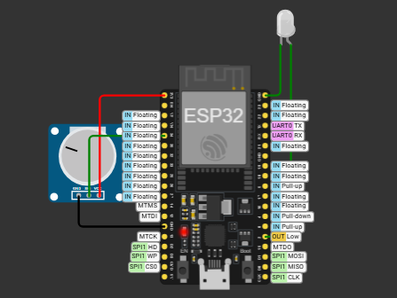
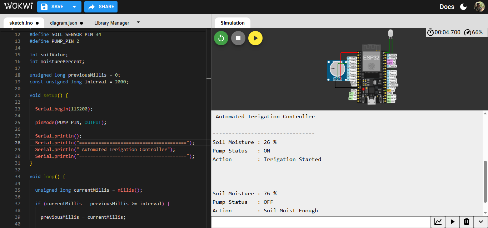

# 💧 Automated Irrigation Controller

Project 02 of the Decode Labs IoT Engineering Internship

A simple IoT-based automated irrigation system built using an ESP32 and a simulated soil moisture sensor (potentiometer). The project continuously monitors soil moisture levels and automatically controls a water pump, represented by an LED, based on the moisture percentage.

---

## Project Overview

Automated irrigation is one of the most common applications of the Internet of Things (IoT) in smart agriculture. This project demonstrates how an ESP32 monitors soil moisture using a simulated soil moisture sensor (potentiometer) and automatically controls a simulated water pump (LED) whenever the soil becomes dry. The implementation is developed and tested entirely using the Wokwi simulator.

---

## Objectives

- Interface a soil moisture sensor with the ESP32
- Read real-time soil moisture values
- Convert analog readings into moisture percentage
- Automatically control irrigation based on soil moisture
- Display moisture level and pump status on the Serial Monitor

---

## Hardware Components

| Component | Quantity |
|----------|----------|
| ESP32 Dev Board | 1 |
| Potentiometer (Simulated Soil Moisture Sensor) | 1 |
| LED (Water Pump Indicator) | 1 |
| 220Ω Resistor | 1 |

---

## Software Used

- Arduino IDE
- Visual Studio Code
- Wokwi Simulator
- Git & GitHub

---

## Circuit Connections

| Component | ESP32 Pin |
|-----------|-----------|
| Potentiometer VCC | 3.3V |
| Potentiometer GND | GND |
| Potentiometer Signal | GPIO 34 |
| LED Anode (+) | GPIO 2 |
| LED Cathode (-) | GND |

---

## Working Principle

1. The ESP32 continuously reads the analog value from a potentiometer, which simulates the soil moisture sensor.
2. The analog reading is converted into a soil moisture percentage.
3. If the moisture level falls below the predefined threshold, the LED (representing the water pump) is turned ON.
4. If the moisture level is above the threshold, the LED is turned OFF.
5. The soil moisture percentage and pump status are displayed on the Serial Monitor every two seconds.

---

## Project Structure

```
Project-02-Automated-Irrigation-Controller
│
├── code
│   ├── sketch
│   │   └── sketch.ino
│   ├── diagram.json
│   ├── libraries.txt
│   └── wokwi.toml
│
├── images
├── README.md
└── report.md
```

---

## ▶ Running the Project

1. Open the project in Arduino IDE.
2. Select **ESP32 Dev Module** as the target board.
3. Compile the sketch.
4. Export the compiled binary (optional for Wokwi offline simulation).
5. Simulate the circuit using Wokwi or upload the sketch to an ESP32 development board.
6. Rotate the potentiometer to simulate changes in soil moisture and observe the automatic pump control.

Note: Since Wokwi does not provide a soil moisture sensor module, a potentiometer is used to simulate soil moisture levels, and an LED is used to represent the irrigation pump during simulation.

---

## 📷 Output

### Circuit Diagram



### Running Simulation



---

## License

This project was developed as part of the Decode Labs IoT Engineering Internship for educational purposes.