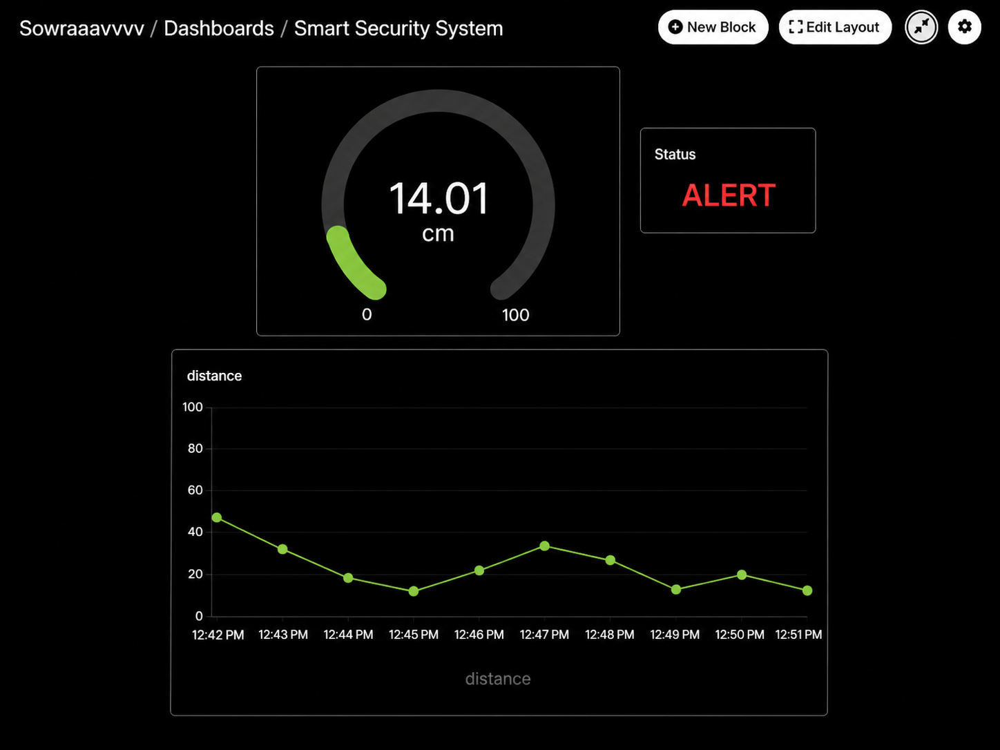

# Cloud Connected Smart Security System

> Project 03 of the Decode Labs IoT Engineering Internship

A cloud-connected IoT security monitoring system built using an ESP32, HC-SR04 Ultrasonic Sensor, LED, MQTT, and Adafruit IO.

The system continuously measures the distance of nearby objects and automatically detects potential intrusions. Distance measurements and security status are transmitted over Wi-Fi using the MQTT protocol and visualized in real time on an Adafruit IO dashboard, enabling remote monitoring from anywhere.

---

# Project Overview

Modern IoT security systems not only detect intrusions locally but also transmit data to the cloud for real-time monitoring and analytics.

This project demonstrates how an ESP32 interfaces with an HC-SR04 ultrasonic sensor to measure distance, detect nearby objects, provide a local LED alert, and publish telemetry to the cloud using MQTT. The live data is displayed on an Adafruit IO dashboard, allowing users to remotely monitor the security status.

---

# Objectives

- Interface the HC-SR04 Ultrasonic Sensor with the ESP32
- Measure the distance of nearby objects
- Detect objects within a predefined threshold
- Turn ON an LED when an intrusion is detected
- Connect the ESP32 to Wi-Fi
- Publish sensor data to Adafruit IO using MQTT
- Display live distance and security status on a cloud dashboard
- Understand cloud-connected IoT communication using MQTT

---

# Hardware Components

| Component | Quantity |
|-----------|----------|
| ESP32 Dev Board | 1 |
| HC-SR04 Ultrasonic Sensor | 1 |
| LED | 1 |
| Breadboard | 1 |
| Jumper Wires | As Required |

---

# Software & Cloud Services

- Arduino IDE
- Visual Studio Code
- Wokwi Simulator
- Adafruit IO
- MQTT (PubSubClient)
- Git & GitHub

---

# Circuit Connections

## HC-SR04

| HC-SR04 Pin | ESP32 Pin |
|-------------|-----------|
| VCC | 5V |
| GND | GND |
| TRIG | GPIO 5 |
| ECHO | GPIO 18 |

## LED

| LED Pin | ESP32 Pin |
|----------|-----------|
| Anode (+) | GPIO 2 |
| Cathode (-) | GND |

---

# System Architecture

```
                 Object

                   │

                   ▼

        HC-SR04 Ultrasonic Sensor

                   │

            Distance Measurement

                   │

                   ▼

                 ESP32

         ┌─────────┴─────────┐
         │                   │
         ▼                   ▼

     LED Alert          Wi-Fi Connection

                             │

                             ▼

                     MQTT Protocol

                             │

                             ▼

                      Adafruit IO

                             │

                             ▼

                  Cloud Dashboard
```

---


#  Working Principle

1. The ESP32 initializes the HC-SR04 sensor and LED.
2. The ultrasonic sensor continuously measures the distance to nearby objects.
3. The ESP32 calculates the measured distance every two seconds.
4. If the measured distance is less than the predefined threshold (20 cm), an intrusion is detected.
5. The LED turns ON to indicate a local alert.
6. The ESP32 connects to Wi-Fi.
7. Distance and security status are published to Adafruit IO using MQTT.
8. The cloud dashboard updates in real time, displaying:
   - Distance Gauge
   - Security Status
   - Distance Trend Graph

---

#  Project Structure

```
Project-03-Smart-Security-Alert-System
│
├── code
│   ├── sketch
│   │   └── sketch.ino
│   ├── diagram.json
│   ├── libraries.txt
│   └── wokwi.toml
│
├── images
│
|── README.md
```

---

# ▶ Running the Project

1. Open the project in Arduino IDE or Wokwi.
2. Install the required libraries.
3. Update the Wi-Fi credentials.
4. Update the Adafruit IO Username and AIO Key.
5. Compile and upload the sketch.
6. Start the Wokwi simulation or run it on an ESP32.
7. Move an object closer to the HC-SR04 sensor.
8. Observe:
   - LED indication
   - Serial Monitor output
   - Live Adafruit IO dashboard updates

---

# 📷 Output

## Circuit Diagram


## Running Simulation




The dashboard displays:

- Live Distance Gauge
- Security Status (SAFE / ALERT)
- Distance History Graph


---

# 📄 License

This project was developed as part of the Decode Labs IoT Engineering Internship for educational purposes.
