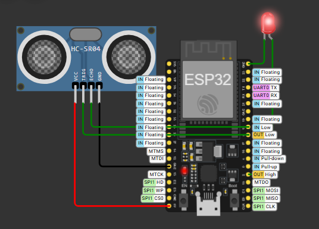
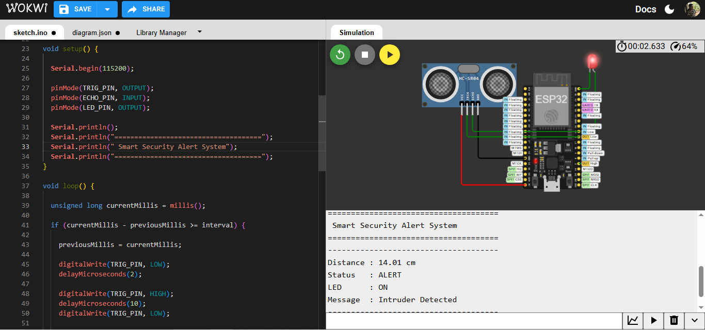

#  Smart Security Alert System

> Project 03 of the Decode Labs IoT Engineering Internship

A simple IoT-based security monitoring system built using an ESP32, an HC-SR04 Ultrasonic Sensor, and an LED. The project continuously measures the distance of nearby objects and automatically turns the LED ON whenever an object is detected within a predefined range.

---

#  Project Overview

Smart security systems are one of the most common IoT applications used in homes, offices, warehouses, and restricted areas. This project demonstrates how an ESP32 interfaces with an HC-SR04 ultrasonic sensor to detect nearby objects and trigger an LED as a visual alert.

---

#  Objectives

- Interface the HC-SR04 Ultrasonic Sensor with the ESP32
- Measure the distance of nearby objects
- Detect objects within a predefined threshold
- Turn ON an LED when an object is detected
- Display distance and alert status on the Serial Monitor
- Understand basic sensor interfacing using Arduino IDE

---

# 🔧 Hardware Components

| Component | Quantity |
|-----------|----------|
| ESP32 Dev Board | 1 |
| HC-SR04 Ultrasonic Sensor | 1 |
| LED | 1 |

---

# 💻 Software Used

- Arduino IDE
- Visual Studio Code
- Wokwi Simulator
- Git & GitHub

---

# 🔌 Circuit Connections

| HC-SR04 Pin | ESP32 Pin |
|-------------|-----------|
| VCC | 5V |
| GND | GND |
| TRIG | GPIO 5 |
| ECHO | GPIO 18 |

| LED Pin | ESP32 Pin |
|---------|-----------|
| Anode (+) | GPIO 2 |
| Cathode (-) | GND |

---

#  Working Principle

1. The ESP32 initializes the HC-SR04 ultrasonic sensor and LED.
2. The ultrasonic sensor continuously measures the distance to nearby objects.
3. The ESP32 reads the measured distance every two seconds.
4. If the detected object is within the predefined threshold distance, the LED turns ON.
5. If no nearby object is detected, the LED remains OFF.
6. The measured distance and system status are displayed on the Serial Monitor.

---

#  Project Structure

```
Project-03-Smart-Security-Alert-System
│
├── code
│   ├── sketch
│   │   └── sketch.ino
│   ├── diagram.json
│   ├── libraries.txt
│   └── wokwi.toml
│
├── images
│
├── README.md
└── report.md
```

---

# ▶ Running the Project

1. Open the project in Arduino IDE.
2. Select **ESP32 Dev Module** as the target board.
3. Compile the sketch.
4. Simulate the circuit in Wokwi or upload it to an ESP32 board.
5. Move an object closer or farther from the ultrasonic sensor to observe the LED and Serial Monitor output.

---

# 📷 Output

## Circuit Diagram



## Running Simulation




---

# 📄 License

This project was developed as part of the Decode Labs IoT Engineering Internship for educational purposes.
